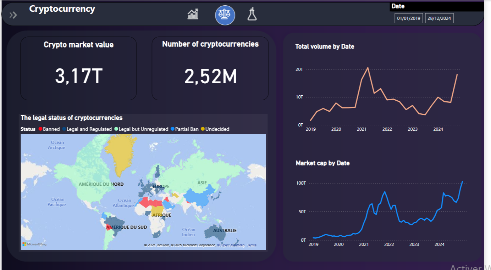
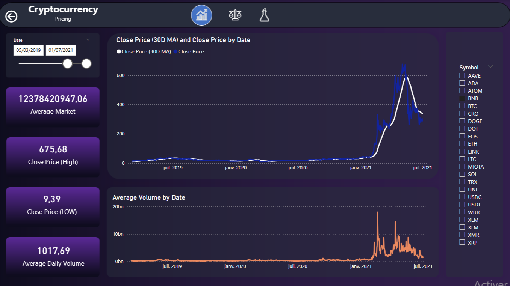
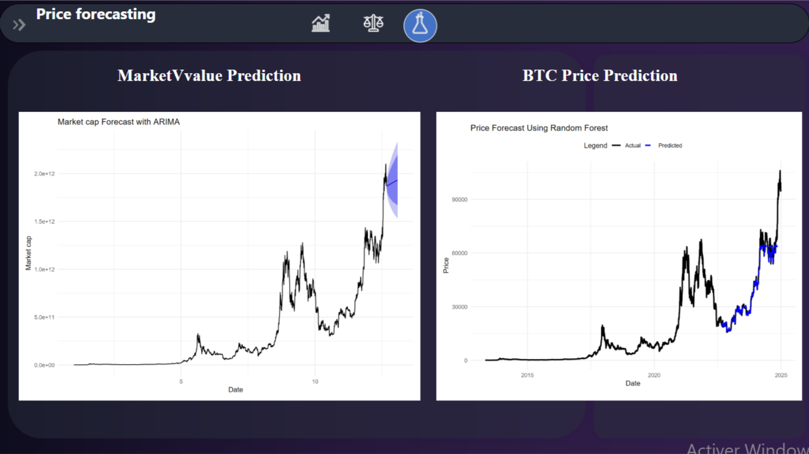

# 📊 Cryptocurrency Price Forecasting Dashboard

This project presents an interactive **Power BI dashboard** for analyzing and forecasting cryptocurrency data, with a particular focus on **Bitcoin (BTC)**. The goal is to provide deep insights into crypto price trends and support data-driven investment decisions using a combination of **descriptive analytics** and **predictive modeling**.

> 📌 **Data Source**: All data is sourced from [CoinGecko](https://www.coingecko.com/), a widely used and trusted cryptocurrency market API.

---

## 🧠 Objectives

- Visualize historical pricing and volume trends of cryptocurrencies
- Forecast future cryptocurrency market behavior using ML & statistical models
- Integrate Python & R scripts inside Power BI for live model execution
- Highlight BTC trends for strategic investment analysis

---

## 🧪 Tools and Technologies

| Tool       | Purpose                          |
|------------|----------------------------------|
| Power BI   | Dashboard and visual analytics   |
| Python     | Random Forest for BTC prediction |
| R          | ARIMA model for market cap       |
| CoinGecko API | Data collection                |

---

## 🖼️ Dashboard Pages Overview

### 📄 Page 1: Market overview

---

### 📄 Page 2: Cryptocurrency Pricing Overview

This page presents historical cryptocurrency pricing and volume data. Key features:

- **Date Filter**: Select a specific range to explore.
- **Close Price Graph**:
  - 📘 **Blue Line**: Daily close price
  - ⚪ **White Line**: 30-day moving average (smoothed trend)
- **Average Volume Graph**: Tracks changes in trading activity
- **Sidebar Metrics**:
  - **Average Market Cap** over selected range
  - **Highest/Lowest Close Price**
  - **Average Daily Volume**

> Symbol selection (right panel) lets users focus on a specific cryptocurrency (BTC, ETH, BNB, etc.).

---

### 📄 Page 3: Price Forecasting with ML & Statistical Models

This page contains **two forecasting models**, implemented directly within Power BI using **R and Python scripts**:

- 🔹 **Left Chart**:  
  Forecast of total **cryptocurrency market capitalization** using the **ARIMA model** in **R**. The shaded blue zone represents the **forecast interval**, capturing prediction uncertainty.

- 🔹 **Right Chart**:  
  **Bitcoin price prediction** using a **Random Forest** regression model scripted in **Python**.  
  - **Black Line**: Actual BTC price  
  - **Blue Line**: Predicted BTC price  
  This model uses historical features to learn BTC trends and forecast future prices.

> ✅ The use of **embedded R and Python scripts** within Power BI allows dynamic forecasting and seamless integration of machine learning insights directly into visual reports.

---

## 📁 Project Structure
├── README.md
├── dashboard.pbix # Power BI report file with video
├── data/
├── images/

---

## 📈 Conclusion

This dashboard serves as a powerful tool for analyzing cryptocurrency markets. By combining time series models (ARIMA) with machine learning (Random Forest), it enables robust forecasting to support better investment planning and risk management.

---

## 📬 Contact

**Grine Mohamed El Amine**  
MSc in Data Science for Business  
📧 [mgrine66@gmail.com](mailto:mgrine66@gmail.com)

---

> ⭐ *If you find this project helpful or inspiring, feel free to star the repo or fork it for your own use.*

